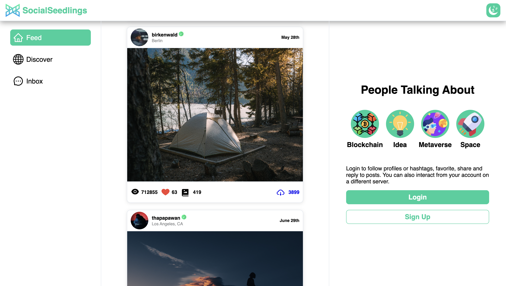
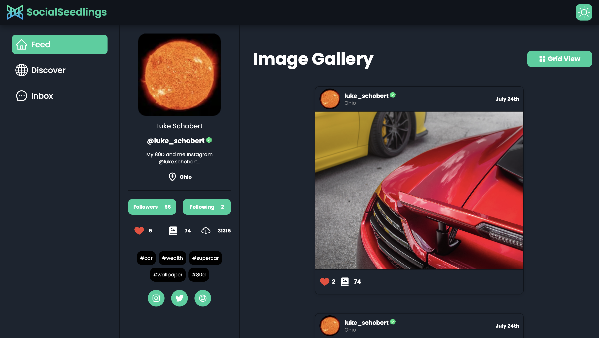
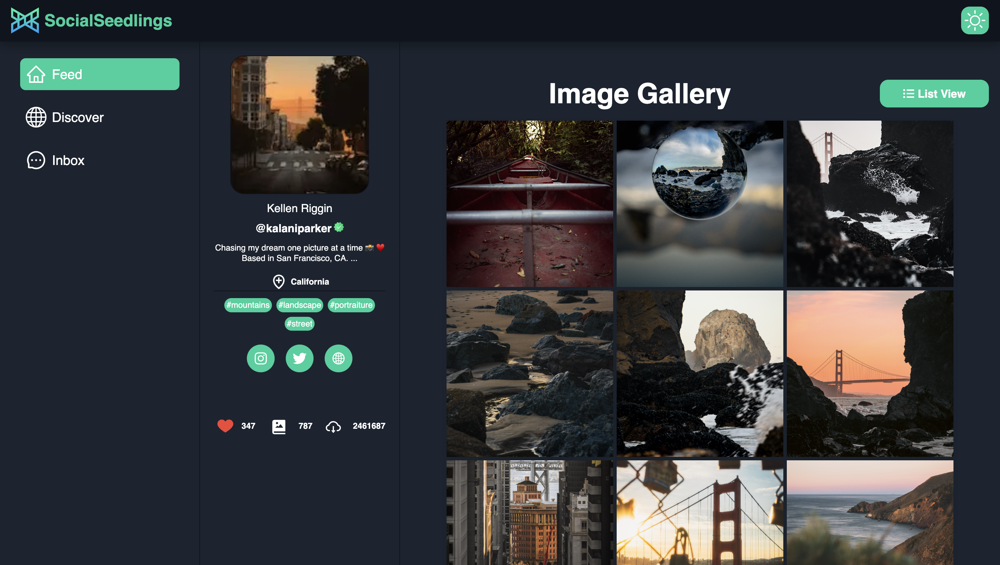

### [Social Seedlings](https://social-seedlings.vercel.app/)

**Social Seedlings** is an innovative and immersive social media application designed for the meta universe, offering users a seamless and captivating online experience. With its cutting-edge features,**Social Seedlings** stands out as a pioneer in the world of virtual social networking.

# Visit Social Seedlings:

https://social-seedlings.vercel.app

## Video Demo

https://github.com/HarshKumarraghav/SocialSeedlings/assets/72187191/d7ae133d-e686-41f9-bcdb-ffb08e752d24

<p align="center">

</p>
<div align="center">

[](https://linkedin.com/in/https://www.linkedin.com/in/harsh-kumar-raghav-7285311b9/) [](https://twitter.com/https://twitter.com/_Harsh_raghav_)

</div>

## Home Page



## Profile Page

## Dark



## Light



## 🛠️ Tech Stack Used in Social Seedlings:

- **NextJS 13:** A popular JavaScript library for building user interfaces, providing a fast and responsive application.
- **React-Query:** Powerful asynchronous state management for TS/JS, React.
- **Unsplash API:** The most powerful photo engine in the world.

---

## 💻 Development

### Install Repository

```git
git clone https://github.com/HarshKumarraghav/SocialSeedlings.git
```

### Run Project

Install node modules and run the project.

```
npm install
or
yarn install
```

```
npm run dev
or
yarn run dev
```

### Finish

```
Your project is running on https://localhost:3000.
```
